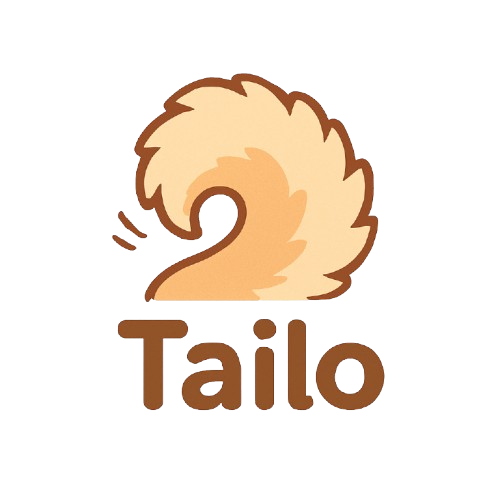

<br/>

<div align="center">
  <h1>Tailo</h1>
  <p>반려동물 기반 SNS 플랫폼</p>
</div>

<br/>

<div align="center">
  
</div>

<br/>

<div align="center">
  <a href="https://taillo-ten.vercel.app/login">홈페이지</a>
</div>

---

## ✍️ 프로젝트 개요

- **프로젝트명:** Tailo (반려동물 기반 SNS 플랫폼)
- **프로젝트 기간:** 2025.04.12 ~ 2025.04.30

---

## ✍️ 프로젝트 소개

### 프로젝트 배경
 - 반려동물과의 소중한 일상을 기록하고, 이를 다른 반려인들과 공유할 수 있는 전용 소셜 플랫폼을 만들고자 하였습니다. <br> 단순한 사진 공유를 넘어, 반려동물 중심의 커뮤니티 형성을 목표로 하였습니다.

---

## 📌 주요 기능

### **1. 사용자 기능**
- 소셜 로그인
- 프로필 정보 조회 / 수정 기능
  - 프로필 이미지 업로드

### **2. 피드**
- 게시글 작성 / 수정 / 삭제 기능
  - 이미지 및 해시태그 첨부 가능
- 피드별 댓글 및 좋아요 기능

### **3. 소셜 네트워크 기능**
- 사용자 간 팔로우 / 언팔로우 / 차단 기능
- 피드 및 사용자 검색 기능

### **4. 1:1 실시간 채팅 기능**
- 실시간 메시지 전송 및 수신

---

## 🧑‍💻 팀원 소개

| **이름**    | **역할**        | 
|:-----------:|:---------------:|
| 오예준      | BE              | 
| 정누리      | BE              | 
| 정하승      | FE              | 

---

## ⚙️ 기술 스택

<div align="center">
  
</div>

<table>
  <thead>
    <tr>
      <th>분류</th>
      <th>기술 스택</th>
    </tr>
  </thead>
  <tbody>
    <tr>
      <td>프론트엔드</td>
      <td>
        
        
        
        
      </td>
    </tr>
    <tr>
      <td>백엔드</td>
      <td>
        
        
        
        
      </td>
    </tr>
    <tr>
      <td>데이터베이스</td>
      <td>
        
        
      </td>
    </tr>
    <tr>
      <td>인프라</td>
      <td>
        
        
        
        
        
        
    </tr>
  </tbody>
</table>


---

## 📂 기타

- [FrontEnd 개발 트래커](https://github.com/orgs/Tailo-Project/projects/5)
- [BackEnd 개발 트래커](https://github.com/orgs/Tailo-Project/projects/3/views/2)

---


# 프론트엔드 코딩 컨벤션

## 목차

- [파일 및 폴더 구조](#파일-및-폴더-구조)
- [명명 규칙](#명명-규칙)
- [React 컴포넌트](#react-컴포넌트)
- [TypeScript](#typescript)
- [CSS / Styling](#css--styling)
- [Import 순서](#import-순서)
- [코드 포맷팅](#코드-포맷팅)
- [주석](#주석)
- [Git 커밋 메시지](#git-커밋-메시지)
- [스택](#스택)
- [선정 이유](#선정-이유)
- [개발 환경](#개발-환경)
- [와이어프레임](#와이어프레임)

## 파일 및 폴더 구조

### 폴더 구조

```
src/
├── assets/          # 프로젝트에서 사용하는 이미지, 아이콘, 폰트 등 정적 파일
├── components/      # 재사용 가능한 UI 컴포넌트 모음
│   ├── common/      # 여러 곳에서 공통적으로 쓰이는 컴포넌트 (예: LoadingSpinner, ConfirmModal 등)
│   ├── features/    # 도메인/기능별 컴포넌트 (예: profile, feed, chat 등)
│   ├── form/        # 폼 관련 컴포넌트
│   └── ...          # 기타 개별 컴포넌트 파일
├── hooks/           # 커스텀 React 훅 (예: useProfile, useDebounce 등)
├── api/             # API 요청 관련 함수 (예: profile.ts)
├── constants/       # 상수값 및 환경설정 (예: apiUrl.ts)
├── layouts/         # 페이지 레이아웃 컴포넌트 (예: layout.tsx)
├── utils/           # 유틸리티 함수 (예: date.ts, auth.ts 등)
├── core/            # 핵심 비즈니스 로직, 서비스, API 래퍼 등
├── contexts/        # React Context API 관련 파일 (상태 관리)
├── ui/              # UI 관련 컴포넌트 및 페이지 (pages, components 등)
│   ├── components/  # UI 전용 컴포넌트
│   └── pages/       # 실제 라우팅되는 페이지 컴포넌트 (예: MainPage, FeedDetailPage)
├── App.tsx          # 앱 진입점, 전체 라우팅 및 글로벌 설정
├── main.tsx         # React DOM 렌더링 엔트리포인트
├── types.ts         # 전역 타입 정의
├── token.ts         # 토큰 관련 유틸리티
├── authService.ts   # 인증 관련 서비스 함수
```

### 파일 명명 규칙

- 컴포넌트 파일: `PascalCase.tsx` (예: `Button.tsx`, `MapView.tsx`)
- 훅, 유틸리티 파일: `camelCase.ts` (예: `useAuth.ts`, `formatDate.ts`)
- 스타일 파일: 컴포넌트와 동일한 이름 사용 (예: `Button.styles.ts`)
- 테스트 파일: `.test.tsx` 또는 `.spec.tsx` 접미사 사용

## 명명 규칙

### 변수 및 함수

- 변수와 함수는 `camelCase` 사용
- 의미 있는 이름 사용 (예: `getUserData`보다 `fetchUserProfile`이 더 명확함)
- 불리언 변수는 `is`, `has`, `should` 등의 접두사 사용 (예: `isLoading`, `hasError`)

```typescript
// 좋은 예
const isUserLoggedIn = true;
const fetchUserData = async () => {
    /* ... */
};

// 나쁜 예
const loggedin = true;
const data = async () => {
    /* ... */
};
```

### 상수

- 상수는 `UPPER_SNAKE_CASE` 사용

```typescript
const API_BASE_URL = 'https://api.example.com';
const MAX_RETRY_COUNT = 3;
```

### 컴포넌트

- 컴포넌트는 `PascalCase` 사용
- 파일명과 컴포넌트명 일치시키기

```typescript
// Button.tsx
const Button = ({ children, onClick }) => {
    return { children };
};

export default Button;
```

## React 컴포넌트

### 함수형 컴포넌트 사용

- 클래스형 컴포넌트 대신 함수형 컴포넌트와 훅 사용

```typescript
// 좋은 예
const UserProfile = ({ userId }: UserProfileProps) => {
  const [user, setUser] = useState(null);

  useEffect(() => {
    fetchUser(userId).then(data => setUser(data));
  }, [userId]);

  return {user ? user.name : 'Loading...'};
};
```

### Props 타입 정의

- 컴포넌트 Props는 인터페이스로 정의하고 명확한 이름 사용
- Props 인터페이스 이름은 컴포넌트 이름 + Props 형식 사용

```typescript
interface ButtonProps {
    variant?: 'primary' | 'secondary';
    size?: 'small' | 'medium' | 'large';
    onClick?: () => void;
    disabled?: boolean;
    children: React.ReactNode;
}

const Button = ({ variant = 'primary', size = 'medium', onClick, disabled, children }: ButtonProps) => {
    // ...
};
```

### 컴포넌트 구조화

- 큰 컴포넌트는 작은 컴포넌트로 분리
- 컴포넌트 내부에서 로직과 렌더링 부분 분리

```typescript
const UserDashboard = () => {
  // 1. 상태 관리
  const [users, setUsers] = useState([]);
  const [isLoading, setIsLoading] = useState(false);

  // 2. 이벤트 핸들러
  const handleUserDelete = (userId: string) => {
    // ...
  };

  // 3. 부수 효과
  useEffect(() => {
    // ...
  }, []);

  // 4. 조건부 렌더링
  if (isLoading) return ;

  // 5. 메인 렌더링
  return (

      {users.map(user => (

      ))}

  );
};
```

## TypeScript

### 타입 정의

- 인터페이스와 타입 정의는 명확하고 구체적으로 작성
- 재사용 가능한 타입은 별도 파일로 분리 (`types/` 폴더)

```typescript
// types/user.ts
export interface User {
    id: string;
    name: string;
    email: string;
    role: 'admin' | 'user';
    createdAt: Date;
}

// 재사용 가능한 타입 정의
export type ID = string;
export type Timestamp = number;

// 유니온 타입 활용
export type NotificationType = 'email' | 'sms' | 'push';
```

### any 타입 지양

- `any` 타입은 가능한 사용하지 않기
- 불가피한 경우 `unknown`을 사용하고 타입 가드 적용

```typescript
// 나쁜 예
const processData = (data: any) => {
    return data.value;
};

// 좋은 예
const processData = (data: unknown) => {
    if (typeof data === 'object' && data !== null && 'value' in data) {
        return data.value;
    }
    throw new Error('Invalid data format');
};
```

## CSS / Styling

### TailwindCSS 사용 규칙

- 클래스 이름은 알파벳 순서로 정렬
- 관련 속성끼리 그룹화 (레이아웃, 색상, 타이포그래피 등)
- 반응형 클래스는 모바일 퍼스트 원칙에 따라 작성

```tsx
// 좋은 예
<div className="flex items-center justify-between rounded-lg bg-white p-4 shadow-md md:p-6 lg:p-8">
    <h2 className="text-lg font-bold text-gray-800 md:text-xl">제목</h2>
</div>
```

### 들여쓰기 및 공백

- 들여쓰기는 2칸 사용
- 중괄호, 연산자 주변에 공백 추가
- 함수 선언과 호출 사이에 공백 없음

```typescript
// 좋은 예
const calculateSum = (a: number, b: number): number => {
    return a + b;
};

// 나쁜 예
const calculateSum = (a: number, b: number): number => {
    return a + b;
};
```

## 주석

### 주석 작성 규칙

- 코드가 "무엇"을 하는지보다 "왜" 그렇게 하는지 설명
- 복잡한 로직에는 주석 추가
- JSDoc 스타일 주석 권장

```typescript
/**
 * 사용자 데이터를 가져와 포맷팅하는 함수
 * @param userId - 사용자 ID
 * @returns 포맷팅된 사용자 정보
 */
const fetchAndFormatUser = async (userId: string): Promise => {
    // API에서 가져온 데이터는 snake_case이므로 camelCase로 변환
    const userData = await fetchUser(userId);
    return formatUserData(userData);
};

// TODO: 추후 성능 최적화 필요
function expensiveCalculation() {
    // ...
}
```

## Git 커밋 메시지

### 커밋 메시지 형식

- 커밋 메시지는 다음 형식 준수: `type: subject`
- 타입은 소문자로 시작 (feat, fix, docs, style, refactor, test, chore)
- 제목은 명령문 형태로 작성 (과거형 X)

```
feat: 사용자 위치 기반 대피소 필터링 기능 추가
fix: 지도 마커 클릭 시 오류 수정
docs: README 업데이트
style: 버튼 컴포넌트 스타일 개선
refactor: 사용자 인증 로직 리팩토링
test: 대피소 컴포넌트 테스트 추가
chore: 패키지 의존성 업데이트
```

### 브랜치 명명 규칙

- 브랜치 이름은 `type/description` 형식 사용
- 설명은 짧고 명확하게 작성 (kebab-case 사용)

```
feat/user-location
fix/map-marker-click
refactor/auth-logic
```

## 스택

Front : React, TypeScript, TailwindCSS, Tanstack Query, react-hook-form
Deploy : Vercel
Build : vite

## 선정 이유

### TailwindCSS

초반에 빠른 디자인을 위해 채택했습니다.

### Tanstack Query

좋아요 기능을 구현하면서 피드 리스트 및 피드 상세에서 좋아요 기능을 추가해야 했는데, Tanstack Query의 캐싱 기능을 이용하면 유용할 것이라 생각해서 적용했습니다.

### react-hook-form

입력 폼이 많아질수록 관리해야 하는 state가 늘어나고 유효성 검사 및 에러 처리에 대한 중복 코드가 늘어날 것이라 생각해서 적용했습니다.

## 와이어프레임

[링크](https://www.figma.com/design/idMxRdIYXeFxHkw44OBZ7k/tailo?node-id=0-1&t=OfRMmrv6iTBaeSQv-1)
